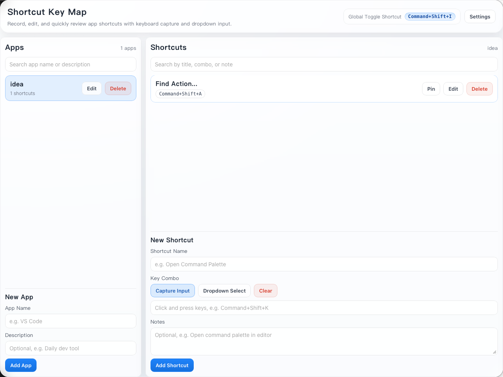

# Shortcut Key Map

[中文版本](./README.md)

## Quick Links

- [Features](#features)
- [Tech Stack](#tech-stack)
- [Local Development](#local-development)
- [Build](#build)
- [Common Scripts](#common-scripts)
- [Configuration](#configuration)
- [Database](#database)
- [License](#license)

A desktop shortcut memory tool built with **Tauri 2 + Vue 3 + SQLite**.  
It supports menu bar resident mode, global toggle shortcut, shortcut input, and categorized management.




## Features

- App management: create, edit, and delete apps (with delete confirmation)
- Shortcut management: create, edit, and delete shortcuts (with delete confirmation)
- Pin shortcuts: prioritize shortcuts you still need to memorize
- Two shortcut input modes:
  - Capture input: press key combinations directly
  - Dropdown select: modifier keys + primary key
- Local persistence with SQLite
- macOS menu bar tray resident mode: click icon to quickly show/hide window
- Global shortcut to toggle window (default: `CmdOrCtrl+Shift+I`, configurable in settings)
- Multi-display support: popup follows the screen where your mouse is located
- Window position mode: supports 9-grid positions (top-left/top-center/top-right/center-left/center/center-right/bottom-left/bottom-center/bottom-right)
- Window behavior: always-on-top, visible across all spaces, auto-hide on blur
- Apple-style UI: rounded window, frosted-glass panel, lightweight toast notifications

## Tech Stack

- Tauri 2
- Vue 3 + TypeScript
- Vite
- rusqlite (SQLite)

## Local Development

```bash
npm install
npm run tauri dev
```

## Build

```bash
npm run tauri build
```

Default build output on macOS:

- `src-tauri/target/release/bundle/macos/Shortcut Key Map.app`

## Common Scripts

```bash
npm run build           # frontend build
npm run check:backend   # Rust backend check
npm run test:backend    # Rust backend tests
npm run verify          # one-command regression check (includes debug build)
```

## Configuration

Current window configuration:

- `src-tauri/tauri.conf.json`

Defaults:

- fixed window size: `1280 x 960`
- `transparent + decorations: false`
- macOS rounded corners via `windowEffects.radius`

## Database

- Filename: `shortcut-key-map.sqlite3`
- Location: Tauri `app_data_dir` (resolved automatically per OS user directory)

## License

This project is licensed under the [MIT License](./LICENSE).
